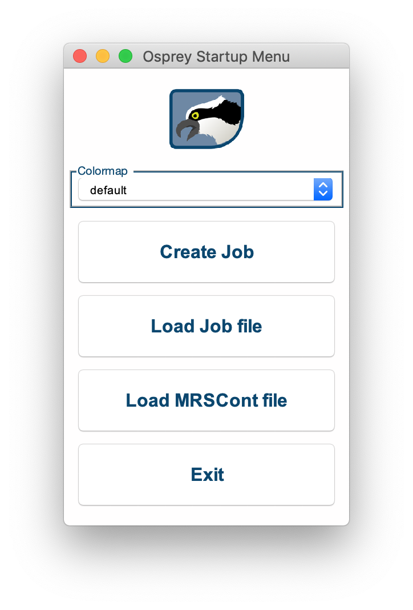
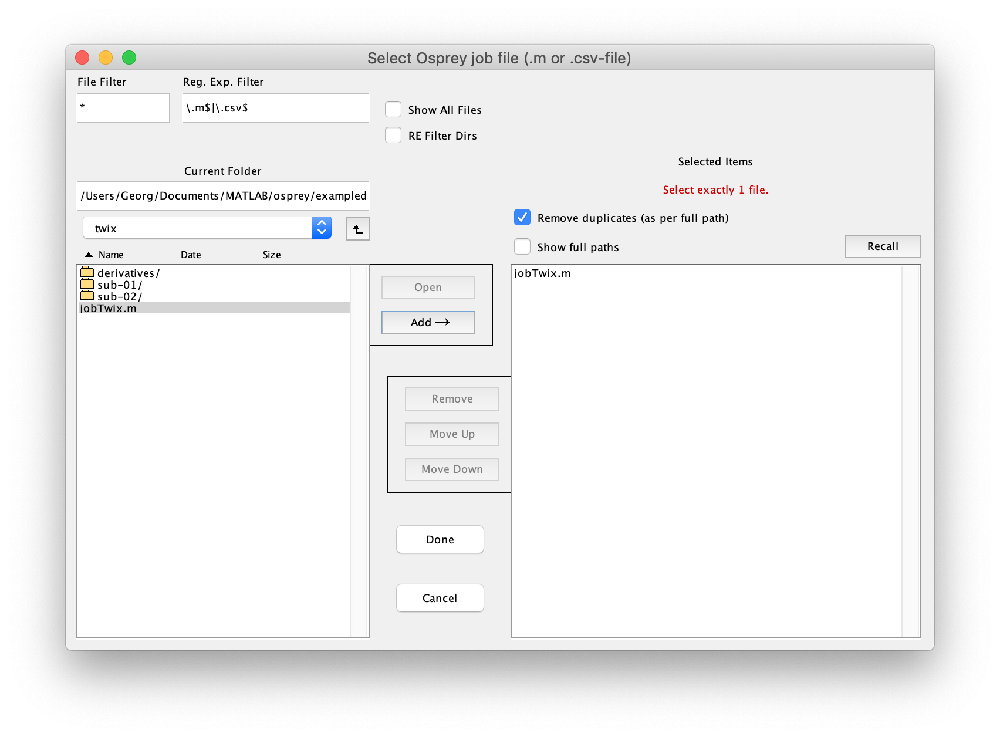

# MRS analysis for Gut Brain GABA pilot
Carolyn McNabb 2021 - Find me at https://github.com/CarolynMcNabb</br>
All analysis scripts are available [here](https://github.com/CarolynMcNabb/GBGABA_pilot_analysis/tree/main/MRS_Osprey_analysis)


The first time you run these scripts, whether on the virtual machine (VM) or on MacOS, you will need to make any bash scripts executable (you don't need to worry about this for the Matlab scripts). To do this, run the following command in the terminal, replacing `script_name` with the relavant script name and `path_to_script` with the relevant path to the directory where your scripts are kept. Note that this is likely to be a different path for the VM and MacOS. You only have to do this **ONCE** for each script.
```
chmod u+x path_to_script/script_name
```

Every time you log onto a terminal, you need to remind it where your scripts are (or you can modify your bash profile). Once again, replace `path_to_script` with your actual path. In the terminal, type:
```
PATH=$PATH:path_to_script
export PATH
```

**N.B. All the paths in the scripts are specific to my own directories - the paths for the VM should be able to be used without adjusting but the MacOS paths will obviously need to be changed to match your own before continuing.** 

### 2.0. Copy MRS files into BIDS directory
This step needs to be carried out **after** you have run the dcm2bids conversion (see instructions in the [BIDS_conversion](https://github.com/CarolynMcNabb/GBGABA_pilot_analysis/tree/main/BIDS_conversion) folder).</br>
In an Ubuntu terminal in the VM (Vanilla or NeuroDebian, it doesn't matter), type:
```
2.0_mv_files.sh
```
You will need to manually enter the participant ID from the scanner session, as well as the BIDS subject ID and session ID. The reason this isn't done as a batch process is because you should be converting and checking your data after every session, not just at the end of data collection.


### 2.1. Set up Osprey
The MRS analysis will be performed using [Osprey](https://schorschinho.github.io/osprey/). For this, you will need MATLAB 2017a or newer. I used MATLAB 2020a and it worked well using my scripts. You also need the `Optimization` and `Statistics and Machine Learning` toolboxes.<br/> It is best to clone the Osprey repository on [GitHub](https://github.com/schorschinho/osprey) and use that, as you will be able to keep up with the latest bug fixes, etc. If you have any problems, the Osprey developers are very good at responding to queries on the [MRSHub Forum](https://forum.mrshub.org/). Just use the tag `Osprey` and they will see it.<br/>
Once everything is working, open Matlab and run the following script:
```
OspreySetup.m
```

### 2.2. Check quality of MRS data
**After every data collection session, the quality of the MRS data must be checked immediately.** The raw data on the scanner computer will be overwritten after a day or so (depending on how busy the scanner is) and once this happens, you will no longer be able to recover the twix files... so make sure you do this as soon as you can after the scan.<br/>
You can choose to do the quality check in the GUI or in the command line - either way, you will need the GUI at the end to view the output.<br/>
Open the `quality_check_MC.m` or `quality_check_OCC.m` file and modify the subject and session numbers on lines 5 and 6 to match those of the current dataset.<br/>
Open the `QualityCheck.m` file and modify the Voxel of Interest on line 5. This should either be `'OCC'` or `'MC'`.<br/>

Using the command line approach, run the following script in MATLAB:
```
QualityCheck.m
```
Once the `QualityCheck.m` script has finished running, open the `ViewOutput.m` file and modify the subject ID, session ID and Voxel of Interest. To view the output from the quality check, in the MATLAB terminal, type:
```
ViewOutput.m
```

If you don't feel like using the command line, you can do all the same steps as above by opening the Osprey GUI and running through the preprocessing and analysis steps one-by-one. This does take a long time though. To do this, in the MATLAB terminal window, type:
```
Osprey
```
This will open the Osprey GUI in MATLAB. <br/>
<br/>
You should select the button labelled `Load Job file`<br/>
This will open a navigation pane, where you should navigate to the `QualityCheck.m` job file. This will likely be wherever you cloned this repository.<br/>
<br/>
Then you just need to navigate through the steps one by one. The MRSCont file should save automatically as you go, but you might want to hit the `Save MRSCont` button anyway. 

### 2.3. Running analysis on all datasets
The quality check steps above will need to be run for every participant, as their data comes in. This is to ensure that the quality of the data are good and there is nothing going wrong with the scanner. Once you have all the data for every participant though, you can run these altogether using the following steps.<br/>

First, set up the GLM for the group analysis. For consistency between analyses, use the script/GLM available in the [fMRI analysis pipeline](https://github.com/CarolynMcNabb/GBGABA_pilot_analysis/blob/main/fMRI/3.6_GLMSetup.R). If this hasn't been run already, you will need to run the script in R:
```
3.6_GLMSetup.R
```
The GLM will save into the `gbgaba/pilotBIDS/derivatives/MRS/anaylysis/GLMs` folder on the gold storage drive.

Back in MATLAB, check the `GroupAnalysis.m` jobfile to make sure it is calling the right files and the right GLM. The jobfile is set up to loop through all the subject directories in the pilotBIDS folder and pull the MRS data from session 1 (`ses-01`). This is the correct set up for Work Package 1. When you want to analyse data for Work Package 2, you will need to modify both the `GroupAnalysis.m` script and the GLM script to account for the repeated measures design. I would suggest making new scripts altogether, to avoid confusion.<br/>
Once you are happy with the jobfile and GLM, run the following script in MATLAB:
```
GroupAnalysis.m
```
The output will be stored in `gbgaba/pilotBIDS/derivatives/MRS/anaylysis/` on the gold storage drive.


